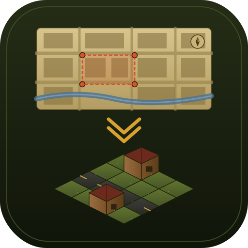
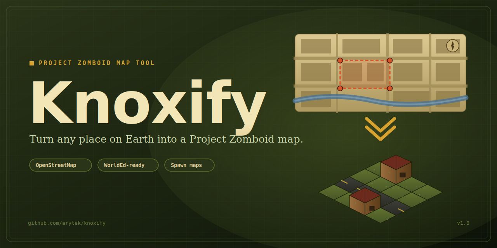
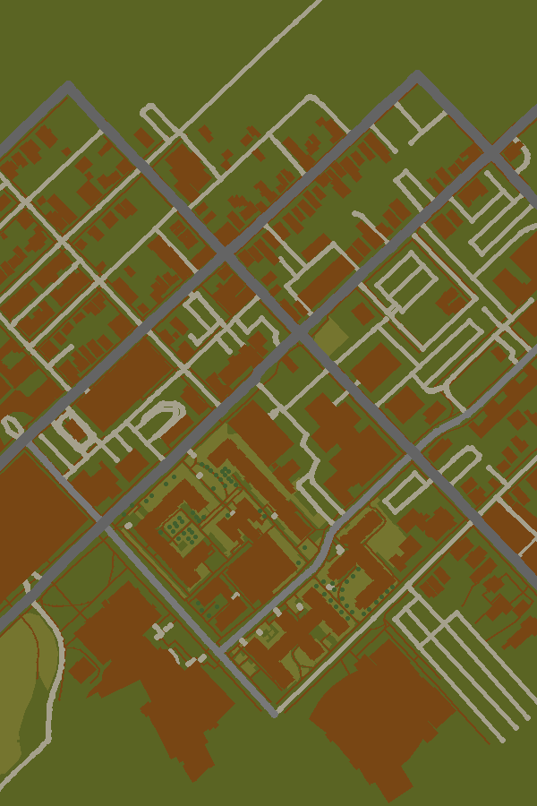

<p align="center">
  
</p>

<h1 align="center">Knoxify</h1>

<p align="center"><em>Turn any place on Earth into a Project Zomboid map.</em></p>



You pick a spot on an interactive world map. Knoxify queries OpenStreetMap
for the terrain there — roads, water, forests, grass, buildings — and
rasterizes it into the three BMP files that Project Zomboid's mapping
toolchain expects. You import those into WorldEd and you're off.

The name's a nod to Knox Country, where the PZ universe is set.

This tool follows the workflow described in Thuztor's
**Mapping Guide v0.2**, a community resource originally posted on
[The Indie Stone forums](https://theindiestone.com/forums/).

### Example output

A 600 × 900 tile chunk of Lexington, KY (2 × 3 PZ cells):



## What it does

- Displays a world map (Leaflet + OpenStreetMap tiles).
- Lets you draw a rectangle over any area on Earth.
- Queries the Overpass API for terrain and building features inside it.
- Rasterizes those features into Project Zomboid's exact color palette:
  - `<mapname>.bmp` — landscape (grass, asphalt, dirt, water, sand)
  - `<mapname>_veg.bmp` — vegetation (trees, bushes)
  - `<mapname>_ZombieSpawnMap.bmp` — grayscale spawn density (1/10 scale)
- Rounds the output to PZ's 300 × 300 tile cell grid.
- Exports a preview PNG, building-footprint GeoJSON, and a ZIP bundle.
- Writes a README in each output folder telling you how to import.

Every pixel in the BMPs is one of the colors in the guide's palette — no
anti-aliasing, no stray values — so WorldEd's BMP-to-TMX converter reads
them cleanly.

## What it doesn't do

**It does not build Project Zomboid buildings.** PZ buildings are `.tbx`
files you assemble in BuildingEd; they can't be derived from OSM footprints.
Knoxify exports OSM building outlines as GeoJSON + a placeholder dirt
footprint so you can see where real-world buildings sit and drop matching
`.tbx` lots on top in WorldEd.

## Install

You need Python 3.11+ (tested on 3.12). If Homebrew is around:

```bash
brew install python@3.12
```

Then, from the repo root:

```bash
python3.12 -m venv .venv
source .venv/bin/activate
pip install -r requirements.txt
```

## Run

```bash
source .venv/bin/activate
python app.py
```

Open <http://127.0.0.1:5000/>. Draw a rectangle, pick a scale, click
**Generate map**. Output lands in `output/<mapname>/`.

## Usage

1. **Pan/zoom** the world map to the area you want.
2. Click the **rectangle tool** in the top-left of the map, then draw.
3. The side panel shows area in km², dimensions in meters, and the output
   tile/cell count. Keep it under 20 km² (Overpass rate limits).
4. Choose a scale:
   - `0.5 m/tile` — highest detail, small areas only
   - `1.0 m/tile` — recommended (matches PZ's rough scale)
   - `2.0 m/tile` — bigger area, chunkier roads
5. (Optional) Give your map a name. Defaults to `knoxify_<timestamp>`.
6. Click **Generate map**. Overpass + rendering takes 10–60 s.
7. Download the `.zip` — it contains all three BMPs + a per-map README.

## Importing into Project Zomboid (condensed)

This is the short version. The Mapping Guide has the full picture.

1. Install the Project Zomboid Mapping Tools (WorldEd, TileZed, BuildingEd).
2. In WorldEd: **File → New**, pick the cell grid shown in the output panel.
3. Drag `<mapname>.bmp` onto the empty grid. The `_veg.bmp` is picked up
   automatically because it sits next to the landscape file.
4. **File → BMP to TMX → All cells** to convert.
5. Drop `.tbx` buildings onto cells in the cell editor.
6. **File → Generate Lots** — produces `.lotheader` + `.lotpack`.
7. Copy those into your game's `media/maps/<yourmap>/` folder. See
   chapter 9 of the guide for offset / world-origin detail.

## How features map to PZ colors

| OSM                                 | PZ landscape             | PZ vegetation             |
|-------------------------------------|--------------------------|---------------------------|
| `natural=water`, `waterway=river`   | Water (0, 138, 255)      | —                         |
| `highway=motorway/primary/trunk`    | Dark asphalt             | —                         |
| `highway=secondary/tertiary`        | Medium asphalt           | —                         |
| `highway=residential/service`       | Light asphalt            | —                         |
| `highway=track/path`                | Dirt line                | —                         |
| `natural=beach`, `natural=sand`     | Sand                     | —                         |
| `landuse=farmland`                  | Light grass              | —                         |
| `landuse=grass/meadow`, `leisure=park` | Medium grass          | (park may add tree hints) |
| `landuse=brownfield/quarry`         | Dirt                     | —                         |
| `natural=wood`, `landuse=forest`    | Dark grass (forest floor)| Trees (dense → edges)     |
| `natural=scrub/heath`               | — (landscape untouched)  | Bushes + trees            |
| `natural=tree` (node)               | —                        | Tree dot                  |
| `building=*`                        | Dirt footprint           | — (use .tbx in WorldEd)   |
| default                             | Dark grass               | Nothing                   |

Road widths (in meters) in source code: `renderer.ROAD_WIDTHS_M`.

## Architecture

```
.
├── app.py                  # Flask entry point + API
├── generator/
│   ├── pz_colors.py        # The 11+7 colors from the Mapping Guide
│   ├── osm.py              # Overpass query + tag classifier
│   └── renderer.py         # Projection + rasterization into BMPs
├── templates/index.html    # Leaflet UI
├── static/{css,js}/        # Frontend assets
├── branding/               # Logo + cover (SVG and PNG)
├── output/                 # Generated maps (gitignored in practice)
├── test_pipeline.py        # End-to-end smoke test
└── requirements.txt
```

Projection: per-bbox UTM zone (`EPSG:326xx` / `EPSG:327xx`) so one tile is
reliably `meters_per_tile` meters on the ground. The bbox is expanded to the
next 300-tile cell multiple before rendering.

## Smoke test

Runs a 600 m × 900 m chunk of Lexington, KY end-to-end:

```bash
source .venv/bin/activate
python test_pipeline.py
```

Check `output/_smoketest/smoketest_preview.png` afterward.

## Branding assets

- `branding/logo.svg` + `branding/logo.png` — 512 × 512 square logo.
- `branding/cover.svg` + `branding/cover.png` — 1280 × 640 cover (matches
  GitHub's social-preview dimensions). Upload the PNG under *Settings →
  Social preview* so link unfurls on Twitter/Slack/Discord show the cover.

## Credits

- Project Zomboid mapping toolchain + format: **The Indie Stone** and
  Thuztor's community mapping guide.
- Terrain data: **OpenStreetMap contributors** (ODbL).
- Overpass API: <https://overpass-api.de/>.
