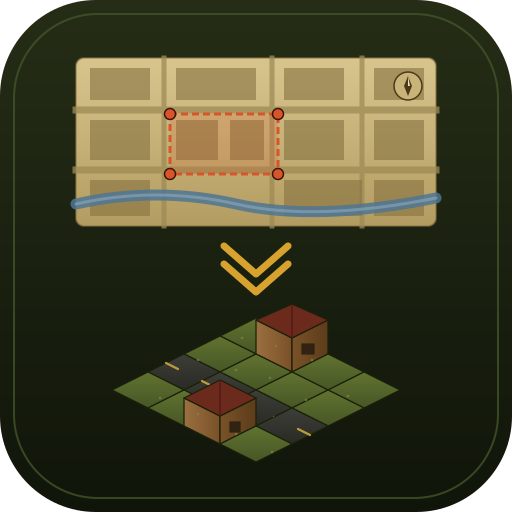
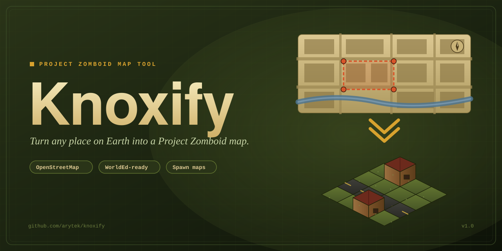
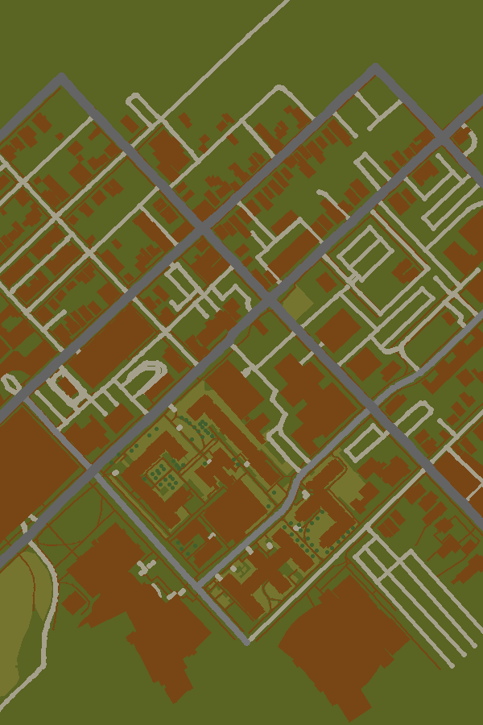

<p align="center">
  
</p>

<h1 align="center">Knoxify</h1>

<p align="center"><em>Turn any place on Earth into a Project Zomboid map.</em></p>



You pick a spot on an interactive world map. Knoxify queries OpenStreetMap
for the terrain there — roads, water, forests, grass, buildings — and
rasterizes it into the three BMP files that Project Zomboid's mapping
toolchain expects. You import those into WorldEd and you're off.

The name's a nod to Knox Country, where the PZ universe is set.

This tool follows the workflow described in Thuztor's
**Mapping Guide v0.2**, a community resource originally posted on
[The Indie Stone forums](https://theindiestone.com/forums/).

### Example output

A 600 × 900 tile chunk of Lexington, KY (2 × 3 PZ cells):



## What it does

- Displays a world map (Leaflet + OpenStreetMap tiles).
- Searches real-world locations by name via Nominatim.
- Lets you draw a rectangle over any area on Earth.
- Builds fixed-size PZ cell selections around the current map center.
- Finds a matching Geofabrik regional data download and prepares it for fast,
  repeatable offline generation. Selections without a local pack use the
  cached, chunked Overpass API path automatically.
- Rasterizes those features into Project Zomboid's exact color palette:
  - `<mapname>.bmp` — landscape (grass, asphalt, dirt, water, sand)
  - `<mapname>_veg.bmp` — vegetation (trees, bushes)
  - `<mapname>_ZombieSpawnMap.bmp` — grayscale spawn density (1/10 scale)
- Rounds the output to PZ's 300 × 300 tile cell grid.
- Exports a preview PNG, building-footprint GeoJSON, source metadata, and a
  ZIP bundle.
- Writes a README in each output folder telling you how to import.
- Shows live export progress, elapsed time, rate-limit waits and separate
  fetching/rendering/packaging timings. Exports can be cancelled, and refreshing
  the page reconnects to the current export.

Every pixel in the BMPs is one of the colors in the guide's palette — no
anti-aliasing, no stray values — so WorldEd's BMP-to-TMX converter reads
them cleanly.

## What it doesn't do

**It does not build Project Zomboid buildings.** PZ buildings are `.tbx`
files you assemble in BuildingEd; they can't be derived from OSM footprints.
Knoxify exports OSM building outlines as GeoJSON + a placeholder dirt
footprint so you can see where real-world buildings sit and drop matching
`.tbx` lots on top in WorldEd.

## Install

You need Python 3.11+ (also tested on Windows with Python 3.14).

Windows Command Prompt:

```bat
python -m venv .venv
.venv\Scripts\activate.bat
python -m pip install -r requirements.txt
python app.py
```

In PowerShell, activate with `.\.venv\Scripts\Activate.ps1` instead.

On macOS, if Homebrew is around:

```bash
brew install python@3.12
```

Then, from the repo root:

```bash
python3.12 -m venv .venv
source .venv/bin/activate
pip install -r requirements.txt
```

## Run

```bash
source .venv/bin/activate
python app.py
```

Open <http://127.0.0.1:5000/>. Search for a place or draw a rectangle, pick a
scale, click **Generate map**. Output lands in `output/<mapname>/`.

## Usage

1. Search for a place by name, or pan/zoom the world map manually.
2. Pick a cell width/height and click **Use map center**, or use the
   rectangle tool for a freeform selection.
3. Under **Map data**, optionally download the suggested region. Downloading
   and preparing it is a one-time operation; future selections fully inside
   that region use local data without API waits. Interrupted downloads resume.
4. The side panel shows area, dimensions, output tile/cell count, and whether
   map data will be local or online. Very large selections are allowed, but
   they can still create huge BMPs.
5. Choose a scale:
   - `0.5 m/tile` — highest detail, small areas only
   - `1.0 m/tile` — recommended (matches PZ's rough scale)
   - `2.0 m/tile` — bigger area, chunkier roads
   - `4.0 m/tile` — largest area, coarser roads and footprints
6. (Optional) Give your map a name. Defaults to `knoxify_<timestamp>`.
7. Click **Generate map**. The progress bar follows completed work through
   map-data fetching, rendering and packaging. The percentage represents
   stage completion, not a prediction of remaining time. An uncached area can
   take minutes when the map service is busy; cached areas skip the network.
8. Download the `.zip` — it contains all three BMPs + a per-map README.

## Importing into Project Zomboid (condensed)

This is the short version. The Mapping Guide has the full picture.

1. Install the Project Zomboid Mapping Tools (WorldEd, TileZed, BuildingEd).
2. In WorldEd: **File → New**, pick the cell grid shown in the output panel.
3. Drag `<mapname>.bmp` onto the empty grid. The `_veg.bmp` is picked up
   automatically because it sits next to the landscape file.
4. **File → BMP to TMX → All cells** to convert.
5. Drop `.tbx` buildings onto cells in the cell editor.
6. **File → Generate Lots** — produces `.lotheader` + `.lotpack`.
7. Copy those into your game's `media/maps/<yourmap>/` folder. See
   chapter 9 of the guide for offset / world-origin detail.

## How features map to PZ colors

| OSM                                 | PZ landscape             | PZ vegetation             |
|-------------------------------------|--------------------------|---------------------------|
| `natural=water`, `waterway=river`   | Water (0, 138, 255)      | —                         |
| `highway=motorway/primary/trunk`    | Dark asphalt             | —                         |
| `highway=secondary/tertiary`        | Medium asphalt           | —                         |
| `highway=residential/service`       | Light asphalt            | —                         |
| `highway=track/path`                | Dirt line                | —                         |
| `natural=beach`, `natural=sand`     | Sand                     | —                         |
| `landuse=farmland`                  | Light grass              | —                         |
| `landuse=grass/meadow`, `leisure=park` | Medium grass          | (park may add tree hints) |
| `landuse=brownfield/quarry`         | Dirt                     | —                         |
| `natural=wood`, `landuse=forest`    | Dark grass (forest floor)| Trees (dense → edges)     |
| `natural=scrub/heath`               | — (landscape untouched)  | Bushes + trees            |
| `natural=tree` (node)               | —                        | Tree dot                  |
| `building=*`                        | Dirt footprint           | — (use .tbx in WorldEd)   |
| default                             | Dark grass               | Nothing                   |

Road widths (in meters) in source code: `renderer.ROAD_WIDTHS_M`.

## Architecture

```
.
├── app.py                  # Flask entry point + API
├── generator/
│   ├── pz_colors.py        # The 11+7 colors from the Mapping Guide
│   ├── osm.py              # Cached/chunked Overpass query + tag classifier
│   ├── packs.py            # Geofabrik discovery, download, preparation, query
│   ├── jobs.py             # Background work, progress, cancellation
│   └── renderer.py         # Projection + rasterization into BMPs
├── templates/index.html    # Leaflet UI
├── static/{css,js}/        # Frontend assets
├── branding/               # Logo + cover (SVG and PNG)
├── output/                 # Generated maps (gitignored in practice)
├── test_pipeline.py        # End-to-end smoke test
└── requirements.txt
```

Projection: per-bbox UTM zone (`EPSG:326xx` / `EPSG:327xx`) so one tile is
reliably `meters_per_tile` meters on the ground. The bbox is expanded to the
next 300-tile cell multiple before rendering.

OSM fetching: large selections are split into ~12 km² Overpass chunks, raw
responses are cached under `output/_cache/`, and duplicate OSM elements are
deduped before the renderer stitches everything into one bitmap set.

Offline packs: Knoxify reads Geofabrik's machine-readable region index and
chooses the smallest extract that covers the full selection. A resumable
download is filtered to the terrain, road, water, vegetation, and building
objects Knoxify uses; required node and relation references are retained in a
prepared PBF under `output/_packs/`. The larger source download is removed
after successful preparation. Generation streams the prepared PBF locally and
checks feature bounds before rasterization. Installed packs can be updated or
removed from the Map data panel.

Fetching uses a persistent HTTP session and prioritizes the last successful
server for subsequent chunks. Failed servers move to the back of the list.
Rate-limit responses wait for the server's `Retry-After` value (or 15 seconds),
with visible status and cancellable waits. Repeated rate limiting stops the
export rather than cycling servers to bypass quotas. Partial/error responses
are not cached; corrupt cache entries are refetched.

For a private or local Overpass instance, set `KNOXIFY_OVERPASS_URL` to its
interpreter URL before starting Knoxify. This replaces the public endpoints.
Public instances are shared resources; see the
[Overpass usage guidance](https://dev.overpass-api.de/overpass-doc/en/preface/commons.html).

Rendering uses NumPy strips for vegetation and limits the preview to a
1600-pixel longest edge. The export BMPs stay at full resolution and keep the
same color palette. ZIPs use faster compression, trading some download size
for less packaging time.

### Export lifecycle

The UI starts exports with `POST /api/jobs`, reads `GET /api/jobs/<id>` and
cancels with `POST /api/jobs/<id>/cancel`. `GET /api/jobs/active` lets another
tab reconnect. The original blocking `POST /api/generate` remains available
for scripts. One export runs at a time so duplicate clicks or tabs cannot
multiply memory usage or API requests.

Job state is kept in the local server process (up to 100 recent jobs).
Refreshing the browser reconnects; restarting the server stops the job.
Completed map-data chunks remain on disk across restarts. Cancellation is
cooperative: an active HTTP request or image write must finish first (the
default HTTP read timeout is 70 seconds). Partial export files can remain in
the output folder; a partial ZIP has a `.zip.part` extension and is never
offered as a completed download. Repeated map names get a unique suffix so
previous exports are preserved.

Large selections still allocate full landscape and vegetation BMPs in memory.
Cell-by-cell rendering and saved checkpoints are the next step for very large
worlds; offline map data removes API constraints but not image-memory limits.

### Automated checks

```bat
python -m unittest discover -s tests -t .
node --test tests/test_frontend.cjs
```

These checks run offline. The separate smoke test below uses the live map service.

## Smoke test

Runs a 600 m × 900 m chunk of Lexington, KY end-to-end:

```bash
source .venv/bin/activate
python tests/test_pipeline.py
```

Check `output/_smoketest/smoketest_preview.png` afterward.

## Branding assets

- `branding/logo.svg` + `branding/logo.png` — 512 × 512 square logo.
- `branding/cover.svg` + `branding/cover.png` — 1280 × 640 cover (matches
  GitHub's social-preview dimensions). Upload the PNG under *Settings →
  Social preview* so link unfurls on Twitter/Slack/Discord show the cover.

## Credits

- Project Zomboid mapping toolchain + format: **The Indie Stone** and
  Thuztor's community mapping guide.
- Terrain data: **OpenStreetMap contributors** (ODbL).
- Overpass API: <https://overpass-api.de/>.
